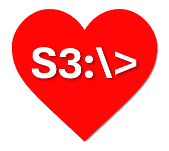

<div align="center">



# S3Drive

**v0.1.0 Alpha** &nbsp;·&nbsp; © 2026 Joel Christner

Your S3 bucket as a local Windows drive.

</div>

---

> **Alpha software.** This is an early release. Configuration formats, behavior, and
> interfaces can and will change between `0.1.x` versions. Do not point it at data you cannot
> afford to lose without testing first.

## What it is

S3Drive mounts an S3 bucket as a local Windows drive letter using
[Dokan](https://github.com/dokan-dev/dokan-dotnet). Because the result is an ordinary Windows
volume, you can share it on the network from Windows Explorer just like any other drive. It
works with **Amazon S3** and with **S3-compatible endpoints** such as
[Less3](https://github.com/jchristn/less3), Ceph, MinIO, and others — including the extra
settings those endpoints need (custom endpoint URL, SSL on/off, access/secret keys, and
virtual-hosted vs path-style addressing).

Two components:

- A **tray agent** that always runs. It owns the actual mounts and does the work.
- A **terminal UI (TUI)** for configuring connections and monitoring the agent.

The agent is the always-on part. The system keeps running — drives stay mounted — **whether or
not the TUI is open**. Closing the TUI does not unmount anything; only choosing **Exit** from
the tray does.

## Features

- **Amazon S3 and S3-compatible endpoints** (Less3, Ceph, MinIO, and others), with endpoint
  URL, SSL toggle, keys, region, and path-style vs virtual-hosted addressing.
- **One drive = one bucket.** A mounted drive's root maps to a single bucket; keys are files
  and `/`-delimited prefixes are folders.
- **Multiple simultaneous mounts.** Each configured connection can mount its bucket to its own
  drive letter at the same time.
- **Configure and go.** Configuring a drive mounts it automatically, and it re-mounts whenever
  the agent starts.
- **Shareable on the network.** A mounted drive is a normal Windows volume, so you share it
  over the network from Windows Explorer — S3Drive does not manage sharing itself.
- **Menu-driven TUI** for configuration and live monitoring, plus a **system tray agent** with
  About and mount/unmount controls.

## Platform support

**S3Drive is Windows-only.** It mounts the drive through [Dokan](https://github.com/dokan-dev/dokany),
a Windows user-mode filesystem driver, so it runs only on Windows. There is **no FUSE (macOS/Linux)
version planned** — S3Drive is not intended to be cross-platform.

## Requirements

- Windows 10/11 (x64).
- The **Dokany** driver installed (S3Drive uses the managed Dokan.NET wrapper over it).
  Download and install it from the official releases page:
  <https://github.com/dokan-dev/dokany/releases>. Dokany is a separate, independently-licensed
  prerequisite (dual **LGPL-2.1 / MIT**, also offered commercially) — it is not bundled with
  S3Drive.
- The **.NET 8 Desktop Runtime** to run, or the **.NET 8 SDK** to build.

## Getting started

From the repository root:

```bat
go.bat
```

`go.bat` builds the solution and launches the TUI. On startup the TUI checks whether the tray
agent is running and starts it if it isn't. Adding a connection in the TUI mounts it
automatically; from the tray you can mount/unmount, open the TUI, or exit.

## Configuration

Configuration lives in `%USERPROFILE%\.s3drive\s3drive.json`. A documented example is in
[`s3drive.sample.json`](s3drive.sample.json). Alongside it, S3Drive keeps:

```
~/.s3drive/
  s3drive.json     connection profiles and global settings
  logs/            application logs
  crash-logs/      crash reports
  state/           agent lock, live status, and the TUI-to-agent command channel
  cache/           per-mount write staging
```

Secret keys are **encrypted at rest** and are never written in plaintext or logged; the TUI
masks them.

## Sharing on the network

A mounted S3Drive drive is an ordinary Windows volume, so you share it exactly as you would any
local drive: in Windows Explorer, right-click the drive, choose **Properties → Sharing**, and
configure the share name and permissions there. S3Drive itself does not manage network sharing —
Windows handles it, which keeps share permissions and access control in one familiar place.

## How files map to objects

S3Drive treats **one file as one object**. Because S3 objects are retrieved whole (no ranged
reads), opening a file downloads the object once to a local staging file and every read is then
served from that local copy. Likewise, because S3 objects are immutable and do not support
partial writes, an open-for-write file is staged locally and written back as a whole object when
it is closed. Byte-range locks are not used; instead, access to each object is serialized with a
coarse named lock so cross-thread access can never corrupt the backing data. The priority is
consistency and coherency, even at the cost of concurrent access to the same file. See
[`S3_OPERATIONS.md`](S3_OPERATIONS.md) for the full per-operation mapping.

## Project layout

```
S3Drive.sln
Directory.Build.props        shared build settings (net8.0, version 0.1.0, conventions)
go.bat                       build the solution and launch the TUI
assets/                      logo.png, logo.ico
src/
  S3Drive.Core/              all logic: config, storage (Blobject), filesystem, mounts, locks
  S3Drive.Agent/             Avalonia tray agent (owns mounts)
  S3Drive.Tui/               TUIKit configuration and monitoring console
test/
  Test.Automated/            deterministic Core tests
```

## Documentation

- [`S3DRIVE_PLAN.md`](S3DRIVE_PLAN.md) — the full design and implementation plan.
- [`CONCURRENCY_AND_LOCKING.md`](CONCURRENCY_AND_LOCKING.md) — exactly how S3Drive handles
  concurrent access and locking, and the boundaries of its guarantees.
- [`S3_OPERATIONS.md`](S3_OPERATIONS.md) — how each filesystem operation maps to S3 requests
  (enumeration, traversal, reads, writes, updates, rename) and where the limitations are.

## Third-party components

S3Drive depends on the following third-party components. Each is the property of its authors
and is used under its own license. The **Dokany driver is a separate prerequisite install** —
it is not bundled with S3Drive and is licensed independently by the Dokan project; obtain it
from <https://github.com/dokan-dev/dokany>.

| Component | Used for | License |
|---|---|---|
| [Dokany](https://github.com/dokan-dev/dokany/releases) (kernel driver, separate install) | User-mode filesystem driver | Dual LGPL-2.1 / MIT (also offered commercially) |
| [DokanNet](https://github.com/dokan-dev/dokan-dotnet) | Managed Dokan wrapper | MIT |
| [Blobject](https://github.com/jchristn/blobject) (`Blobject.Core`, `Blobject.AmazonS3`) | S3 / S3-compatible storage | MIT |
| [AWS SDK for .NET](https://github.com/aws/aws-sdk-net) (`AWSSDK.S3`) | S3 protocol client (used directly for multi-object delete, and via Blobject) | Apache-2.0 |
| [Padlock](https://github.com/jchristn/padlock) | Named locks | MIT |
| [SyslogLogging](https://github.com/jchristn/loggingmodule) | Logging | MIT |
| [PrettyId](https://github.com/jchristn/prettyid) | Identifier generation | MIT |
| [TUIKit](https://www.nuget.org/packages/tuikit) | Terminal user interface | MIT |
| [Avalonia](https://github.com/AvaloniaUI/Avalonia) (`Avalonia`, `.Desktop`, `.Themes.Fluent`) | Tray icon and About window | MIT |
| [.NET 8](https://github.com/dotnet/runtime) / `System.Text.Json` | Runtime and serialization | MIT |

## License

S3Drive itself is licensed MIT — see [`LICENSE.md`](LICENSE.md). Third-party components remain
under their own licenses as listed above.

## Links

- Repository: <https://github.com/jchristn/S3Drive>
- Dokan.NET: <https://github.com/dokan-dev/dokan-dotnet>
